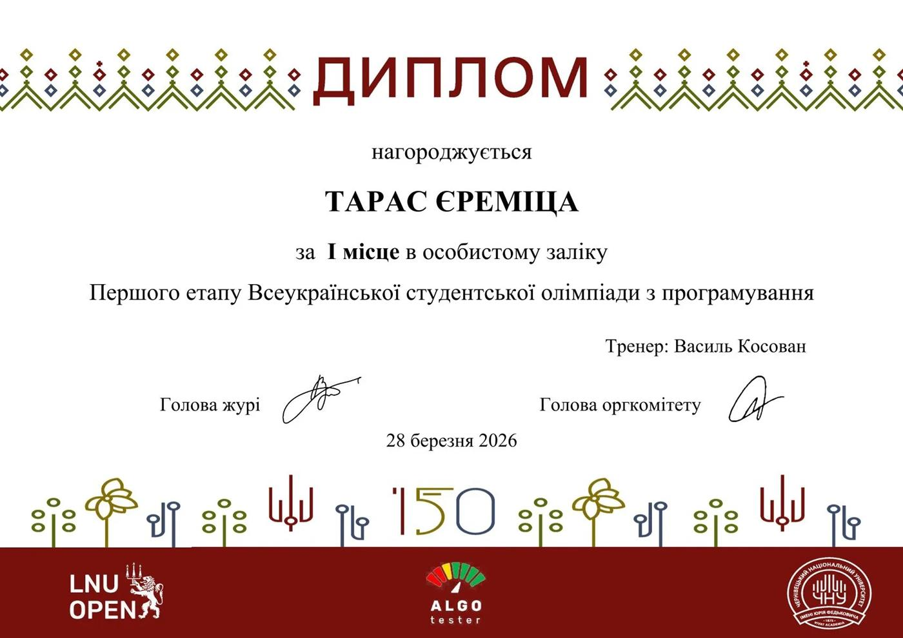
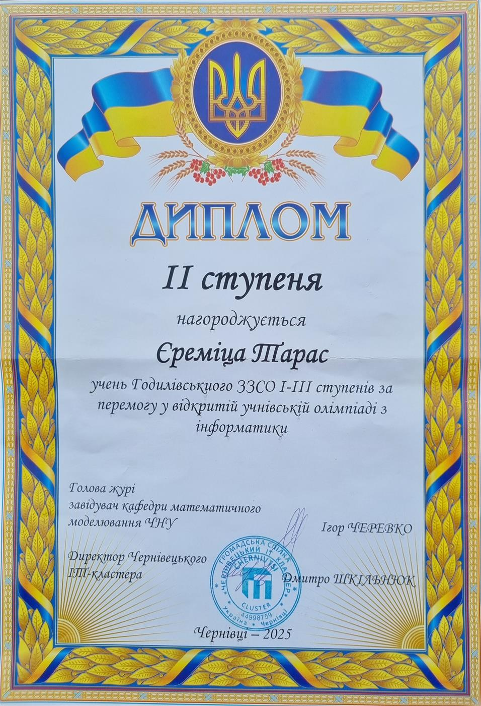
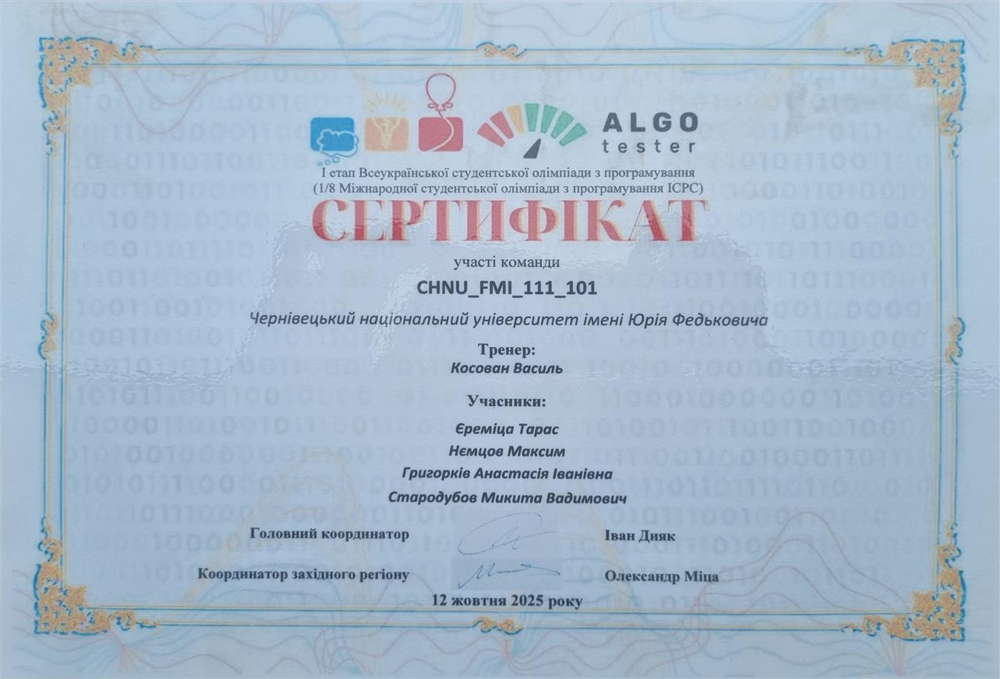
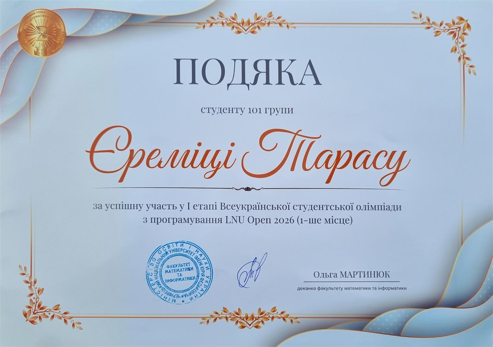
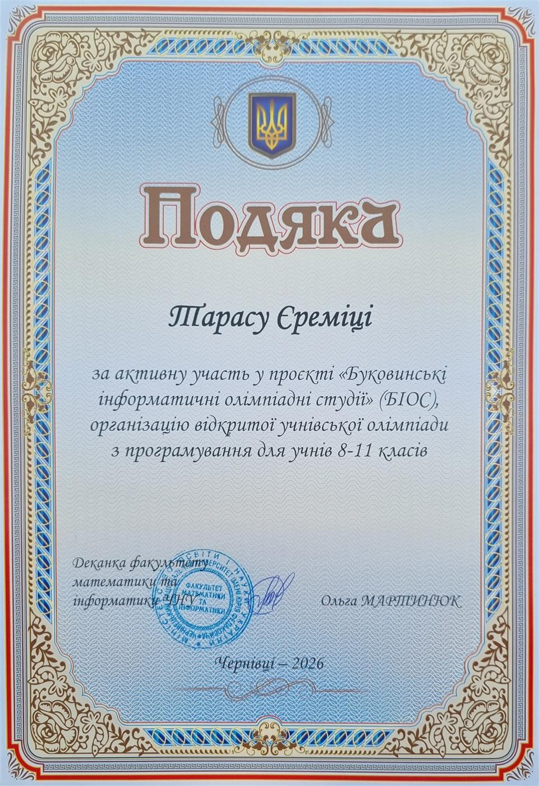
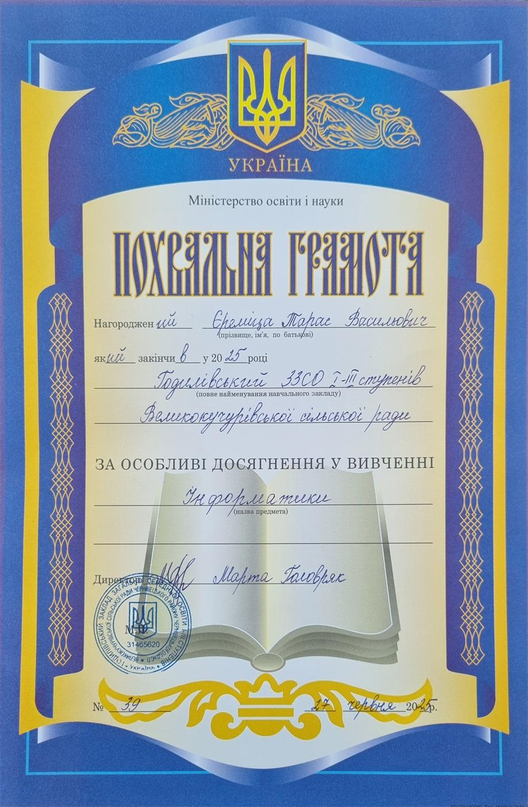

# Hi there, I'm Taras Yeremitsa 👋
### Computer Science Student • Competitive Programmer • Backend & Systems Enthusiast

 

---

### 👨‍💻 About Me

- 🎓 **Education**: Computer Science student at **Yuriy Fedkovych Chernivtsi National University (ЧНУ)** (*Faculty of Mathematics and Informatics*).
- 💡 **Interests**: Algorithmic problem solving, low-level network protocols (TCP/UDP/WebSocket/RakNet), concurrent architectures, and backend systems.
- 🏆 **Competitive Programming**: Active participant in national & regional programming competitions (ICPC, LNU Open, regional Olympiads).
- 🤝 **Community**: Mentor & co-organizer in the **Bukovyna Informatics Olympiad Studies (BIOS)** community, helping train school students for programming olympiads.

---

### 🛠️ Tech Stack & Skills

  
  
  
  
  
  
  
  
  

  
  
  
  
  

---

### 🏆 Honors, Awards & Certifications

<table>
  <tr>
    <td width="50%" valign="top">
      <h4 align="center">🥇 1st Place — Collegiate Programming Championship</h4>
      
<b>All-Ukrainian Collegiate Programming Contest (Stage 1 / LNU Open 2026)</b> 
      <i>Individual Standings • Faculty of Mathematics & Informatics, CHNU</i>

      

        
      

    </td>
    <td width="50%" valign="top">
      <h4 align="center">🥈 2nd Degree Diploma — Olympiad in Informatics</h4>
      
<b>Open Regional Olympiad in Informatics (2025)</b> 
      <i>Organized by Chernivtsi IT Cluster & CHNU Mathematical Modeling Dept.</i>

      

        
      

    </td>
  </tr>
  <tr>
    <td width="50%" valign="top">
      <h4 align="center">📜 ICPC Stage 1 Certificate</h4>
      
<b>ICPC Ukraine / Southeastern European Regional Contest (2025)</b> 
      <i>Team CHNU_FMI_111_101 • 1/8 Final</i>

      

        
      

    </td>
    <td width="50%" valign="top">
      <h4 align="center">🎖️ Dean's Commendation — Academic Excellence</h4>
      
<b>Faculty of Mathematics & Informatics, CHNU</b> 
      <i>Awarded for taking 1st place in Stage 1 of LNU Open 2026</i>

      

        
      

    </td>
  </tr>
  <tr>
    <td width="50%" valign="top">
      <h4 align="center">🎖️ Dean's Commendation — Community & Mentorship</h4>
      
<b>Faculty of Mathematics & Informatics, CHNU</b> 
      <i>For active contribution to BIOS (Bukovyna Informatics Olympiad Studies) & organizing programming olympiads</i>

      

        
      

    </td>
    <td width="50%" valign="top">
      <h4 align="center">🏅 Commendation for CS Excellence</h4>
      
<b>Academic Commendation (2025)</b> 
      <i>For high academic performance and special achievements in Computer Science</i>

      

        
      

    </td>
  </tr>
</table>

---

### 📊 GitHub Activity

  
  &nbsp;
  
    
  

 

---

  Designed with precision • Let's build something awesome together

